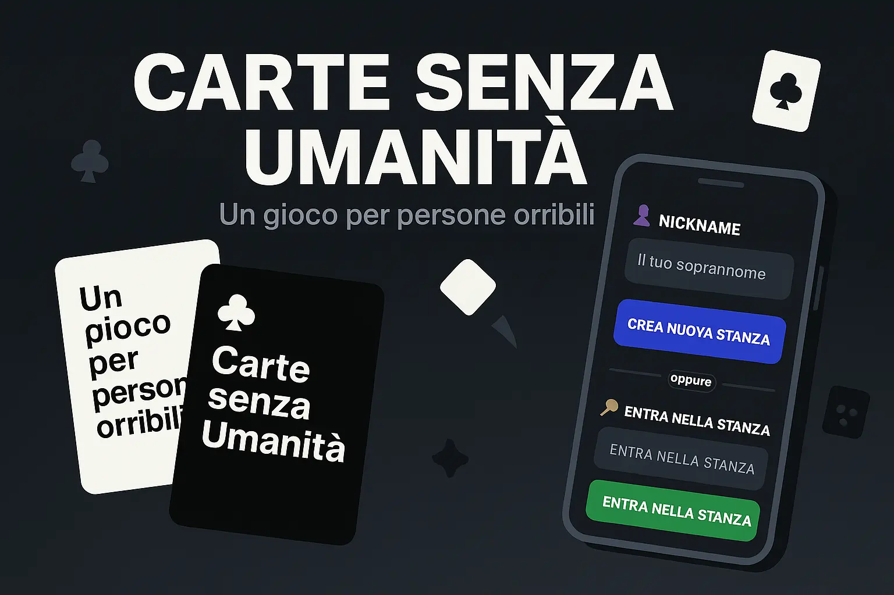

# Carte senza Umanità

Unofficial, non-commercial Italian-language browser party game built around a fill-in-the-blank card format. The application uses a React client and a Node.js/Socket.io server for real-time rooms and rounds.

> Independent fan project. It is not affiliated with or endorsed by Cards Against Humanity.



## What is implemented

- Real-time multiplayer rooms with Socket.io.
- 3 to 10 players per room.
- Host-controlled game start.
- Rotating judge, anonymous shuffled submissions and score tracking.
- One-, two- and three-card prompts.
- Configurable target score and hand size.
- Reconnection support for an existing nickname/room.
- Responsive React interface with light/dark mode.
- An Italian-language deck with **417 white cards** and **234 black cards**.

## Live deployment

Configured Render endpoints:

- Frontend: https://carte-senza-umanita.onrender.com/
- Socket.io backend: https://carte-senza-umanita-server.onrender.com/

A manual smoke test on **2026-09-21** verified a real 3-player game through room join, round play, judge selection, point assignment and next-round flow.

## Architecture

```text
client/
  React + Vite
      |
      | Socket.io
      v
server/
  Express + Socket.io
  GameManager / Room
      |
      v
server/data/
  Italian-language card corpus
```

The server owns room membership, judge rotation, hands, played cards, scoring and round transitions. The client renders the current state and emits player actions.

## Verification

Server-side game-flow tests use Node's built-in test runner and cover:

- room creation and joining;
- host-only start and the 3-player minimum;
- dealing hands and selecting the first judge;
- card submission and the judging phase;
- winner selection and game-over behavior;
- round rotation;
- multi-card prompts;
- reconnection of an existing player.

Run them with:

```bash
cd server
npm test
```

GitHub Actions runs the server tests and a production client build on pushes and pull requests. The final GPR verification run passed both jobs.

## Run locally

Requirements: a current Node.js LTS release and npm.

```bash
npm run install-all
npm run dev
```

Development endpoints:

- client: http://localhost:5173
- server: http://localhost:3001

## Card corpus and provenance

The current corpus contains:

- `server/data/carte_bianche.json`: 417 white cards;
- `server/data/carte_nere.json`: 234 black cards;
- black prompts: 197 one-card, 33 two-card and 4 three-card prompts.

The current files contain no duplicate white-card strings or duplicate black-prompt text.

A provenance audit identified the historical Italian Cards Against Humanity translation and the CaH42project fan expansion as relevant upstream families. Preserved copies of both explicitly use **Creative Commons Attribution–NonCommercial–ShareAlike 2.0 Italy (CC BY-NC-SA 2.0 IT)**. Repository history then documents substantial project-specific additions, rewrites and cleanup.

The complete mixed card corpus in this repository is therefore distributed as adapted fan material under **CC BY-NC-SA 2.0 IT**, with attribution and modification notes in [LICENSE-CARDS.md](LICENSE-CARDS.md) and [CONTENT_NOTICE.md](CONTENT_NOTICE.md).

This does **not** grant trademark rights and does not imply affiliation or endorsement.

## Licenses

- Repository-authored **source code**: [MIT](LICENSE).
- **Card corpus** under `server/data/carte_*.json`: [CC BY-NC-SA 2.0 IT](LICENSE-CARDS.md).
- Third-party trademarks and other rights remain with their respective owners.

The project is non-commercial; no advertising, payment or donation integration is present in the repository.
